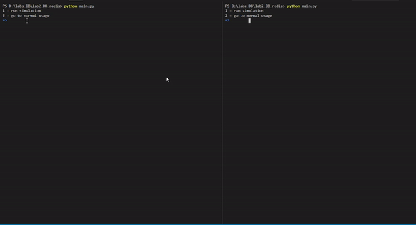

### Обгрунтування вибору структур даних

Для користувачів та адмінів був вибраний set, як найпростіша структра з пошуком O(1), 
також set був вибраний для багатьох інших сутностей наприклад 
черг із статусів, так як порядок сутностей в них не принциповий. 

Для структури повідомлення був вибраний hash для зберігання відправника, 
приймача, а також сам текст повідомлення. При передачі id повідомлення 
виконувачу, останній отримує повну інформацію а також має змогу відправити 
в будь яку чергу потрібні дані.

## Початок роботи з програмою - вибір між просто входом та симуляцією

## Логін

## Інтерфейс користувача

## Інтерфейс адміна

